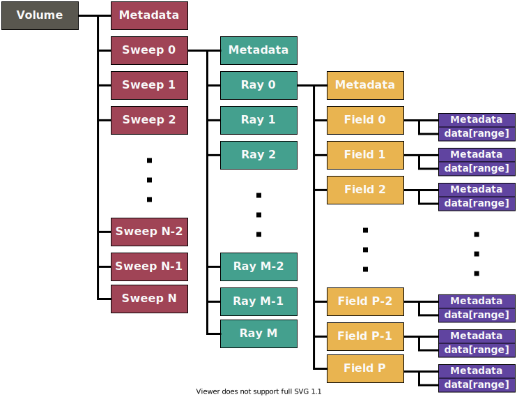
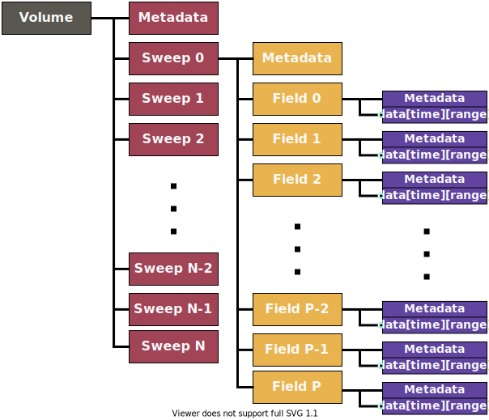
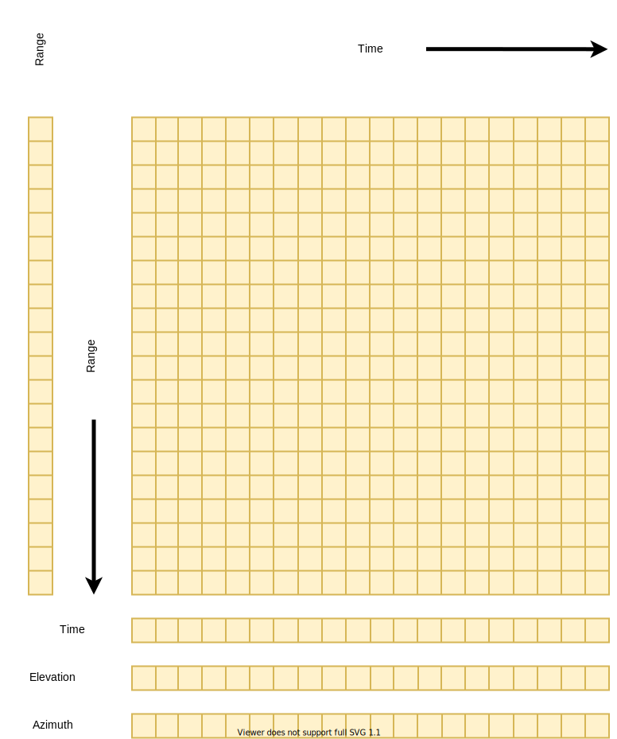

[[data-information, Chapter 2, Data Information Mode]]

== Radar/Lidar Data Information Mode

=== Logical organization of data in a volume, using sweeps and rays

Radars and lidars are pulsing instruments that either scan in polar coordinates, or stare in a fixed direction.

A *volume scan* (or simply a *volume)* is defined as a scanning sequence that repeats over time.

[[sweep_diagram, Figure 1]]
[.text-center]
.Logical data structure for a volume scan, using sweep and ray abstractions and 1-D data field arrays

<<sweep_diagram>> shows an idealized data model for a radar or lidar *volume*, representing the data fields as 1-D arrays on a ray object.

A *volume* consists of a series of 1 or more *sweeps* (defined below).

As a radar or lidar scans (or points), the data *fields* (commonly known as ‘moments’) are computed over limits specified by a time interval or angular interval.

We refer to this entity as a *ray*, beam or dwell. In this document we will use the term *ray*.

A *sweep* is a collection of *rays*, for which certain properties remain constant. Examples are:

* PPI 360-degree surveillance (target elevation angle constant)
* PPI sector (target elevation angle constant)
* RHI (target azimuth angle constant)
* time period for vertically pointing instrument (azimuth and elevation both constant)

The following _always_ remain constant for all *rays* in a *sweep*:

* number of gates
* range geometry (range to each gate)
* sweep mode (_surveillance, sector, RHI_, etc.)
* target angle(s)

The following would _usually_ remain constant for the *rays* in a *sweep*:

* nominal scan rate
* pulse width
* pulsing scheme
* Nyquist velocity
* data quality control procedures

For a given *ray*, the *field* (or moments) data are computed for a sequence of *ranges* increasing radially away from the instrument. These are referred to as range *gates*.

A *ray* contains a number of *fields*, with a value for each *field* at each *gate*. In the ray abstraction, fields are represented as 1-D arrays, with length *range*.

=== Logical organization of data in a volume, using sweeps with 2-D data

[[volume_diagram, Figure 2]]
[.text-center]
.Logical data structure for a volume scan, using the sweep abstraction with 2-D data fields

In contrast to <<sweep_diagram>>, <<volume_diagram>> shows a modified data model, in which the *sweeps* contain the *field* (moments) data directly, stored as 2-D arrays of [time][range]. This requires that the number of gates be constant for all rays in a sweep.

This is the data model that has been adopted for CfRadial2. <<field_data>> below has more detail.

This representation has the advantage that the 2-D arrays per sweep simplify the data storage mechanism, and allow for more efficient data compression than do 1-D arrays per ray.

[[field_data, Figure 3]]
[.text-center]
.Data field for a sweep, represented in time and range, with a constant number of range gates

=== Field data byte representation

The field data will be stored using one of the following:

[[table-field-data]]
.Field Data Representation
[cols=",,",options="header",caption="Table 2.1. "]
|===
| *NetCDF type* | *Byte width* | *Description*
|signed char |1 |scaled signed integer
|unsigned char |1 |scaled unsigned integer
|signed short |2 |scaled signed integer
|unsigned short |2 |scaled unsigned integer
|signed int |4 |scaled signed integer
|unsigned int |4 |scaled unsigned integer
|signed long |8 |scaled signed integer
|signed long |8 |scaled unsigned integer
|float |4 |floating point
|double |8 |floating point
|===

For the integer types, the stored data values are interpreted as:

data_value = (integer_value * scale_factor) + add_offset.

The _scale_factor_ and _add_offset_ are provided as metadata attributes on the field.

=== Scanning modes

Scanning may be carried out in a number of different ways. For example:

* horizontal scanning at fixed elevation (PPI mode), sector or 360 degree surveillance
* vertical scanning at a constant azimuth (RHI mode)
* antenna stationary, i.e. constant elevation and azimuth (staring or pointing)
* aircraft radars which rotate around the longitudinal axis of the aircraft (e.g. ELDORA, NOAA Tail Radar)
* sun scanning in either PPI or RHI mode.

For each of these modes a *sweep* is defined as follows:

* PPI mode: a sequence of rays at a fixed elevation angle, but changing azimuth angles
* RHI mode: a sequence of rays at a fixed azimuth angle but changing elevation angles
* pointing mode: a sequence of rays over some time period, at fixed azimuth and elevation
* aircraft tail-type radars: a sweep starts at a rotation angle of 0 (antenna pointing vertically upwards) and ends 360 degrees later.

As the antenna transitions between sweeps, some rays may be recorded during the transition. For many radars, especially operational types, these rays are filtered out at the source. For some research radars, however, the rays are retained, and an *antenna_transition flag* is set for these rays to allow them to be optionally filtered out at a later processing stage.

=== Geo-reference variables

Metadata variables in CfRadial are used to locate a radar or lidar measurement in space.

These are:

* range
* elevation
* azimuth
* latitude
* longitude
* altitude

See sections 4.3 and 5.4 for details on these variables.

For moving platforms, extra variables are required for geo-referencing. These are:

* heading
* roll
* pitch
* rotation
* tilt

See section 5.4 for details on these variables.

The mathematical procedures for computing data location relative to earth coordinates are described in detail in section 9.