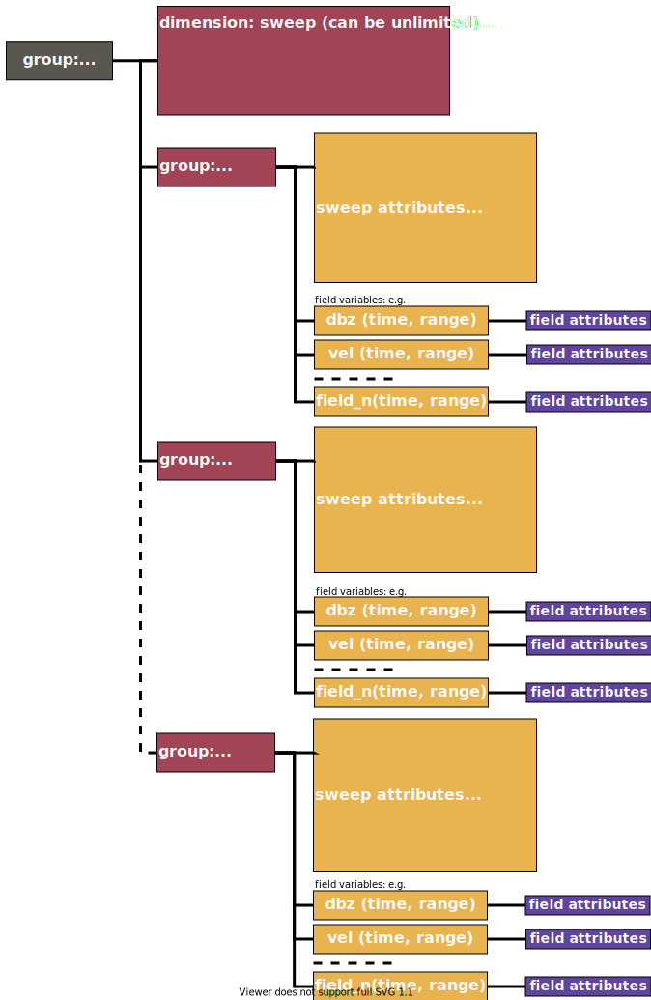
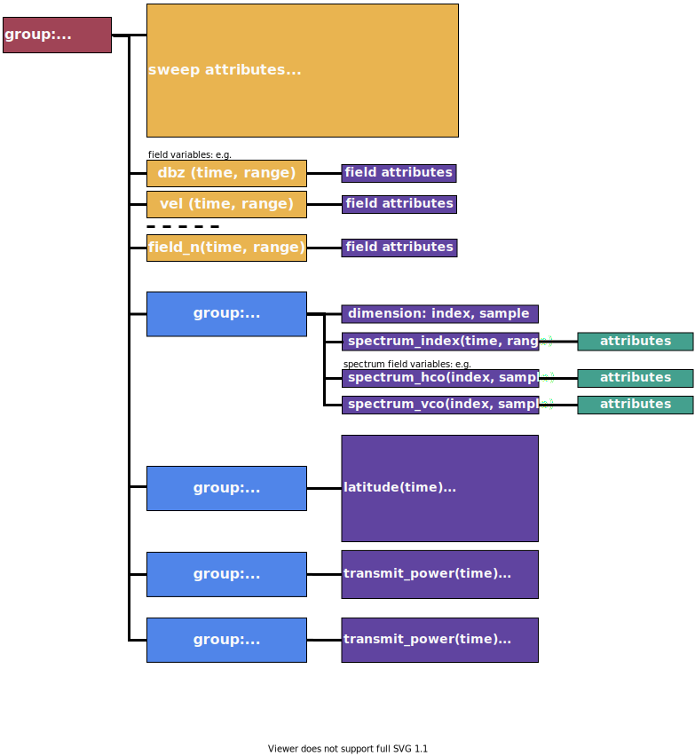
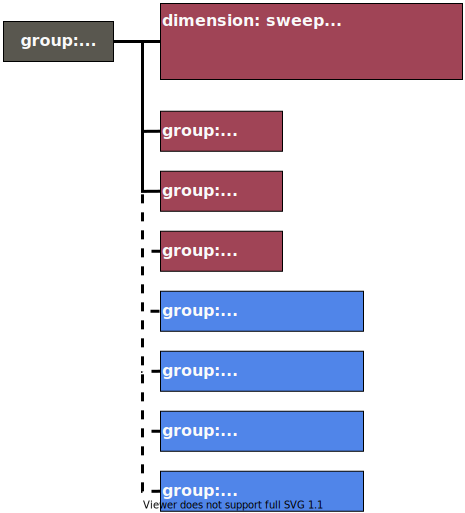

[[data-structure, Chapter 3, Data Structure]]

== Structure of CfRadial2 using NetCDF4 with groups

=== Group-based data structure

In order to be readily accessible to scientists in the user community using legacy applications, CfRadial1 uses the flat classic model of NetCDF3. A drawback of this approach is that the implementation quickly becomes complicated, since much of the metadata is placed at the top level in the data structure. Namespace clashes can easily occur.

By contrast, the European ODIM_H5 format makes extensive use of HDF5 groups to provide logical separation between data at different levels in the structure. In fact ODIM tends to rather over-use this approach, leading to complexity of a different type.

In designing CfRadial2, we chose to merge CfRadial1 and ODIM_H5, adopting the best features of each to produce a clear implementation that is as simple as reasonable, but no simpler. CfRadial2 makes use of the group capability available in NetCDF4.

CfRadial2 adopts the sweep-based model of <<field_data>>. The overall structure is shown in <<group_structure>> below.

The top-level (default) root group holds the global dimensions, attributes and variables. Nested below this group is a sub-group for each sweep. The name of the sweep sub-groups is provided in a string array named ‘sweep_group_name’, also at the top level. This allows the user to locate the sweep groups directly.

CfRadial2 supports moving platforms (aircraft, ships and vehicles), which requires storing the georeference data accurately at each ray time. Furthermore, storage of spectra on a gate-by-gate basis, for example for vertically-pointing precipitation radars, is supported. <<sweep_structure>> shows these details. Both of these are specializations, and are not required for most fixed operational radars.

A number of optional groups are available in the root group, to support radar and lidar parameters, calibrations, and corrections to the georeferenced data. These are shown in <<meta_data_groups>>.

[[group_structure, Figure 1]]
[.text-center]
.Group structure showing top-level dimensions, attributes, variables and sweep groups

[[sweep_structure, Figure 2]]
[.text-center]
.Sweep group structure in more detail, showing support for geo-freference metadata for moving platforms, spectra, and monitoring data. Optional groups are in blue.

[[meta_data_groups, Figure 3]]
[.text-center]
.Optional metadata groups (in blue) in the root group

=== Principal dimensions and coordinate variables

The principal dimensions for data in a sweep are *time* and *range*. In CF terminology these are referred to as _coordinate variables_, which must have the same name for both the dimension and the variable.

The primary coordinate is *time* and the secondary coordinate is *range*.

The length of the *time* coordinate indicates the number of rays in the sweep.

The length of the *range* coordinate indicates the number of gates for the rays in the sweep.

The *time(time)* coordinate variable stores the double precision time of each ray, in seconds, from a reference time, which is normally the start of the volume *(time_coverage_start)*. The units attribute for time indicates the time from which it is referenced.

The *range(range)* coordinate variable stores the range to the center of each gate. All rays in the sweep must have the same range geometry.

The *elevation(time)* coordinate variable stores the elevation angle for each ray.

The *azimuth(time)* coordinate variable stores the azimuth angle for each ray.

The data fields are stored as 2-D arrays, with dimensions *(time, range)*.

=== _FillValue and missing_value attributes for data fields

CF 1.6 states that the use of *missing_value* is deprecated, and that only *_FillValue* should be used.

For CfRadial2, *_FillValue* is preferred. However, *missing_value* may be used.

Only one or the other should be specified, not both.

Applications reading CfRadial data should check for both of these attributes.

NetCDF 4 is built on HDF5, which supports compression. Where data are missing or unusable, the data values will be set to a constant well-known *_FillValue* (or *missing_value*) code. This facilitates efficient compression.

=== Required vs. optional variables

Required variables are shown shaded in this document.

All other variables are optional.

If an optional variable is not provided, reader applications should set the variable to a missing value as appropriate.

=== Grid mapping variable – radar_lidar_radial_scan

The data in this format is saved in the native coordinate system for radars and lidars, i.e. radial (or polar) coordinates, with the instrument at the origin.

In order to properly support this type of data, the _radar_lidar_radial_scan_ grid mapping has been introduced to the CF Conventions:

The mapping parameters are:

• _latitude_of_projection_origin_

• _longitude_of_projection_origin_

• _height_of_projection_origin_

The relevant coordinate variables are as follows:

[cols=",,",options="header",]
|===
|Coordinate variable |Standard name |Auxiliary reference
|range (line-of-sight slant range) |line_of_sight_distance_from_instrument |
|azimuth |sensor_to_target_azimuth_angle |Auxiliary coordinate on the time dimension
|elevation |sensor_to_target_elevation_angle |Auxiliary coordinate on the time dimension
|===

The relevant grid mapping attributes are:

[cols=",,",options="header",]
|===
|Attribute |Type |Description
|height_of_projection_origin |N |Records the height, in meters, of the map projection origin point above the ellipsoid (or sphere). Used by radial scan type projections to indicate the altitude of the sensor to which the polar coordinate system is referenced.
|===

A general description of radar projection is given in Doviak[1984], page 13, equation 2.28b. Note: there is no corresponding projection in PROJ.4.

=== Extensions to the CF convention

This convention requires the following extensions to CF:

[arabic]
. The following axis attribute types:

* axis = "radial_azimuth_coordinate";
* axis = "radial_elevation_coordinate";
* axis = "radial_range_coordinate";

[arabic, start=2]
. For CfRadial to follow CF properly, support for the following must be added to the supported units:

* dB (ratio of two values, in log units. For example, ZDR).
* dBm (power in milliwatts, in log units)
* dBZ (radar reflectivity in log units)

[arabic, start=3]
. Additional standard names – see section 8.

Given the above extensions, CfRadial2 files will be CF2 compliant.

*NOTE on units*: in the following tables, for conciseness, we do not spell out the *units* strings exactly as they are in the NetCDF file. Instead, the following abbreviations are used:

[cols=",",options="header",]
|===
|*Units string in NetCDF file* |*Abbreviation in tables*
|“degrees per second” |degrees/s
|“meters per second” |m/s
|===

=== String types

In NetCDF 4, strings may be represented either as an array of chars (NC_CHAR), or as a string (NC_STRING).

In CfRadial2, all string *_variables_* must be of type NC_STRING. Use of full string types means that no dimension is required for the string length.

String *_attributes_* may be of type NC_STRING or NC_CHAR. *NC_STRING* is the preferred option.

In C, a string attribute is written using the NetCDF API function nc_put_att_string, whereas a char array attribute is written using the nc_put_att_text function.

